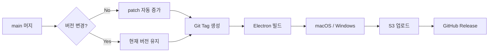

# Charles Monitor

네이버 키워드 광고 API와 실제 검색 화면 크롤링을 결합하여, 사용자가 등록한 키워드의 광고 집행 상태와 실제 검색 노출 순위를 모니터링하는 시스템입니다.

## 📁 프로젝트 구조

```
charles-mvp-b1/
├── client/          # Electron 데스크탑 앱 (React + TypeScript)
├── backend/         # API 서버 + Worker (Express + Puppeteer)
├── docs/            # 프로젝트 문서
└── docker-compose.yml
```

## 🚀 빠른 시작

### 요구사항
- Node.js v20+
- Docker & Docker Compose

### 개발 환경 실행

```bash
# 1. 인프라 실행 (PostgreSQL + Redis)
docker-compose up -d db redis

# 2. 백엔드 실행
cd backend
npm install
npm run dev:api    # API 서버
npm run dev:worker # Worker (별도 터미널)

# 3. 클라이언트 실행
cd client
npm install
npm run dev
```

## 📦 배포 프로세스

클라이언트 앱은 GitHub Actions를 통해 자동으로 빌드 및 배포됩니다.



### 배포 트리거
- **자동**: `main` 브랜치에 푸시/머지 시
- **수동**: GitHub Actions에서 "Run workflow" 클릭

### 빌드 산출물
| 플랫폼 | 파일 형식 |
|--------|-----------|
| macOS  | `.dmg`, `.zip` |
| Windows | `.exe` (NSIS 설치 / Portable) |

### 환경변수 설정

GitHub Repository → Settings → Secrets and variables → Actions에서 설정:

| Secret | 설명 |
|--------|------|
| `AWS_ACCESS_KEY_ID` | S3 업로드용 |
| `AWS_SECRET_ACCESS_KEY` | S3 업로드용 |
| `AWS_REGION` | S3 버킷 리전 |
| `S3_BUCKET` | S3 버킷 이름 |

> 코드 서명 관련 설정은 [/docs/DEPLOYMENT_SIGNING.md](./docs/DEPLOYMENT_SIGNING.md) 참조

## 📖 문서

- [시스템 스펙](./docs/SPEC.md)
- [코드 서명 가이드](./docs/DEPLOYMENT_SIGNING.md)

## 🛠️ 기술 스택

- **Client**: Electron, React, TypeScript, TanStack Query
- **Backend**: Node.js, Express, TypeScript
- **Crawler**: Puppeteer, Bull Queue
- **Database**: PostgreSQL, Redis
- **Infra**: Docker, GitHub Actions

## 📄 License

ISC
