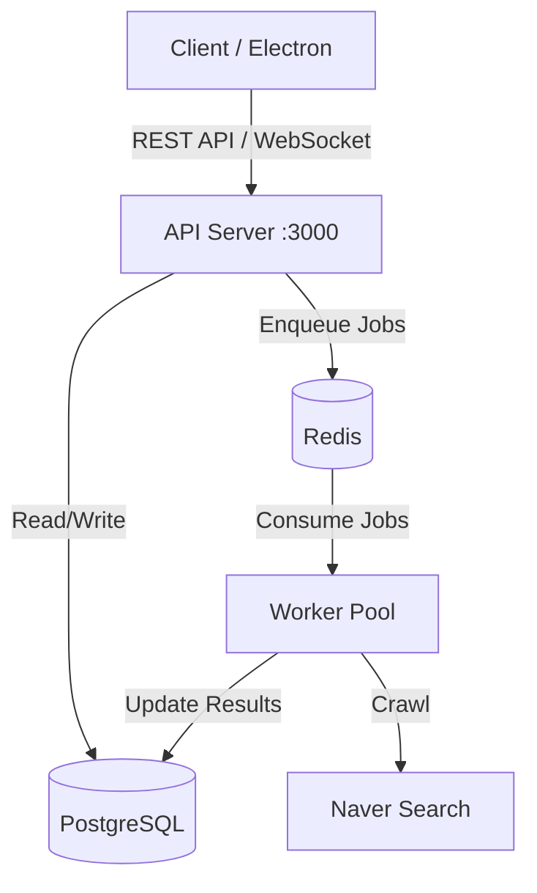

# 네이버 검색 순위 모니터링 시스템 - 서버 분리 아키텍처 테스트 스펙

## 1. 프로젝트 개요

본 프로젝트는 Electron 기반 POC의 백엔드 로직을 서버로 분리하여,  
확장 가능한 크롤링 시스템으로 전환하는 것을 검증한다.

**핵심 목표:**
- API Server + Worker Pool 구조 검증
- Bull Queue 기반 작업 분산 처리
- Docker Compose로 로컬 환경 구성
- Worker 수평 확장 가능성 검증

---

## 2. 시스템 아키텍처



---

## 3. 기술 스택

### 3.1 백엔드
- **Node.js** v20+
- **TypeScript**
- **Express** (API Server)
- **Socket.io** (WebSocket)
- **Bull** (Job Queue)
- **Puppeteer** (크롤링)

### 3.2 데이터베이스
- **PostgreSQL** 16
- **Redis** 7

### 3.3 인프라
- **Docker + Docker Compose**
- **PM2** (Worker 프로세스 관리, 선택사항)

---

## 4. 데이터베이스 스키마

### 4.1 PostgreSQL

```sql
-- keywords 테이블
CREATE TABLE keywords (
  id SERIAL PRIMARY KEY,
  keyword VARCHAR(255) NOT NULL,
  url TEXT NOT NULL,
  last_rank INTEGER,
  last_checked_at TIMESTAMP,
  created_at TIMESTAMP DEFAULT NOW()
);

CREATE INDEX idx_keywords_created ON keywords(created_at DESC);

-- keyword_rankings 테이블
CREATE TABLE keyword_rankings (
  id SERIAL PRIMARY KEY,
  keyword_id INTEGER NOT NULL REFERENCES keywords(id) ON DELETE CASCADE,
  rank INTEGER,
  checked_at TIMESTAMP DEFAULT NOW()
);

CREATE INDEX idx_rankings_keyword_checked ON keyword_rankings(keyword_id, checked_at DESC);
```

### 4.2 Redis
- Bull Queue: `crawl-jobs`

---

## 5. API 명세 (Summary)
- `POST /api/keywords`: Add keyword
- `POST /api/jobs/enqueue`: Trigger crawl
- `GET /api/jobs/queue`: Queue status
- `GET /api/rankings`: Get rankings
- `WS /ws`: Real-time updates

---

## 6. 프로젝트 구조
```
crawler-server/
├── docker-compose.yml
├── package.json
├── src/
│   ├── api/
│   ├── worker/
│   ├── db/
│   ├── queue/
│   └── types/
└── Dockerfile.*
```
