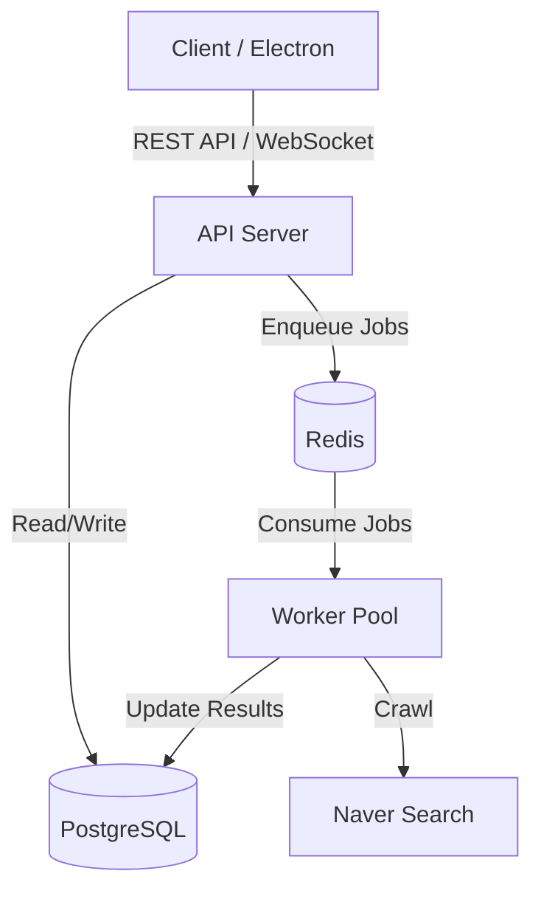

# 네이버 검색 순위 모니터링 시스템 통합 스펙 (Integrated SPEC)

## 1. 프로젝트 개요 (Overview)

본 프로젝트는 **네이버 키워드 광고 API와 실제 검색 화면 크롤링을 결합**하여, 사용자가 등록한 키워드의 광고 집행 상태와 실제 검색 노출 순위를 모니터링하는 시스템이다.

기존의 단일 Electron 앱(MVP) 구조에서, **Client(Electron/Process) - Server(API + Worker)** 분리 아키텍처로 고도화하여 확장성과 안정성을 확보하는 것이 현재 목표이다.

**핵심 목표:**
1. **정확한 모니터링**: 광고 API 데이터와 실제 브라우저 렌더링 기반 크롤링 결과의 교차 검증.
2. **확장 가능한 아키텍처**: Bull Queue 기반작업 분산 및 Worker 수평 확장 지원.
3. **사용자 편의성**: 비개발자(마케터)도 쉽게 사용할 수 있는 Electron 기반 데스크탑 UI 제공.

---

## 2. 시스템 아키텍처 (System Architecture)

시스템은 프론트엔드(Client)와 백엔드(Server/Worker)로 명확히 분리되며, 다음과 같은 데이터 흐름을 가진다.



### 2.1 구성 요소 역할
*   **Client (Electron/React)**:
    *   사용자 UI 제공 (키워드 입력, 결과 조회).
    *   백엔드 API와 통신하여 작업 요청 및 데이터 조회.
*   **API Server (Express)**:
    *   클라이언트 요청 처리 (REST API).
    *   모니터링 작업 스케줄링 및 Queue 적재 (Producer).
    *   실시간 상태 전송 (WebSocket).
*   **Worker (Puppeteer)**:
    *   Redis Queue에서 작업을 가져와 처리 (Consumer).
    *   실제 네이버 검색 결과 페이지(SERP) 크롤링 및 파싱.
    *   광고 및 자연 검색 순위 판별.
*   **Infrastructure**:
    *   **PostgreSQL**: 영구 데이터 저장 (키워드, 순위 이력).
    *   **Redis**: 작업 큐(Bull) 관리 및 캐싱.

---

## 3. 기능 명세 (Functional Specifications)

### 3.1 모니터링 범위
*   **대상**: 네이버 PC 통합검색 결과.
*   **판별 항목**:
    *   **파워링크(광고) 영역**: 내 광고(설정된 랜딩 URL)의 노출 여부 및 순위.
    *   **자연 검색(Organic) 영역**: 타겟 도메인의 노출 여부 및 순위 (VIEW, 웹사이트 등).

### 3.2 주요 기능
1.  **키워드 관리**:
    *   모니터링 대상 키워드 등록/수정/삭제.
    *   키워드별 타겟 URL 설정.
2.  **모니터링 실행 제어**:
    *   수동 즉시 실행 및 스케줄링(Batch) 지원.
    *   동시 실행 수 제한을 통한 차단 방지 (Worker 레벨 제어).
    *   대량 작업 등록 시 Redis 부하 분산을 위한 스케줄러 Throttling (30ms 지연) 적용.
3.  **데이터 조회**:
    *   최신 순위 현황 대시보드.
    *   키워드별 순위 변동 이력 그래프.
4.  **광고 API 연동 (선택사항)**:
    *   실제 집행 중인 광고인지 검증.
    *   월간 검색량, 경쟁도 등 보조 지표 수집.

---

## 4. 기술 스택 (Tech Stack)

### 4.1 Client
*   **Platform**: Electron
*   **Framework**: React, TypeScript, TanStack Query
*   **State**: Zustand (or Context API)

### 4.2 Backend
*   **Runtime**: Node.js v20+
*   **Framework**: Express (API Server)
*   **Language**: TypeScript
*   **Communication**: REST API, Socket.io
*   **Queue**: Bull (Redis based)
*   **Crawling**: Puppeteer (Headless Chrome)

### 4.3 Database & Infra
*   **Primary DB**: PostgreSQL 16
*   **Queue/Cache**: Redis 7
*   **Environment**: Docker, Docker Compose

---

## 5. 데이터베이스 스키마 (Database Schema)

### 5.1 Keywords
모니터링 대상 키워드 및 설정 정보.

```sql
CREATE TABLE keywords (
  id SERIAL PRIMARY KEY,
  keyword VARCHAR(255) NOT NULL,
  url TEXT NOT NULL,         -- 타겟 도메인 또는 랜딩 URL
  last_rank INTEGER,         -- 가장 최근 확인된 순위 (캐싱용)
  last_checked_at TIMESTAMP, -- 최근 확인 시각
  is_active BOOLEAN DEFAULT true,
  created_at TIMESTAMP DEFAULT NOW()
);
```

### 5.2 Keyword Rankings
시간대별 순위 추적 이력.

```sql
CREATE TABLE keyword_rankings (
  id SERIAL PRIMARY KEY,
  keyword_id INTEGER NOT NULL REFERENCES keywords(id) ON DELETE CASCADE,
  rank INTEGER,              -- 감지된 순위 (미노출 시 null 또는 특정 값)
  rank_type VARCHAR(50),     -- 'AD' (광고) or 'ORGANIC' (자연)
  checked_at TIMESTAMP DEFAULT NOW()
);
```

---

## 6. API 명세 요약 (API Summary)

*   `POST /api/keywords`: 키워드 등록
*   `GET /api/keywords`: 키워드 목록 조회 (최신 순위 포함)
*   `POST /api/jobs/enqueue`: 크롤링 작업 수동 요청 (Trigger)
*   `GET /api/jobs/queue`: 현재 큐 상태 조회 (Active, Waiting, Completed...)
*   `GET /api/rankings/:keywordId`: 특정 키워드의 순위 이력 조회
*   `WS /ws`: 실시간 작업 진행 상황(Progress) 및 완료 알림

---

## 7. 향후 로드맵 (Roadmap)
*   다수 Worker 서버 클러스터링을 통한 대량 처리.
*   프록시 서버 연동을 통한 IP 차단 우회.
*   모바일 환경 검색 결과 모니터링 추가.
*   알림 시스템 (순위 급락/상승 시 Slack/Email 알림).
